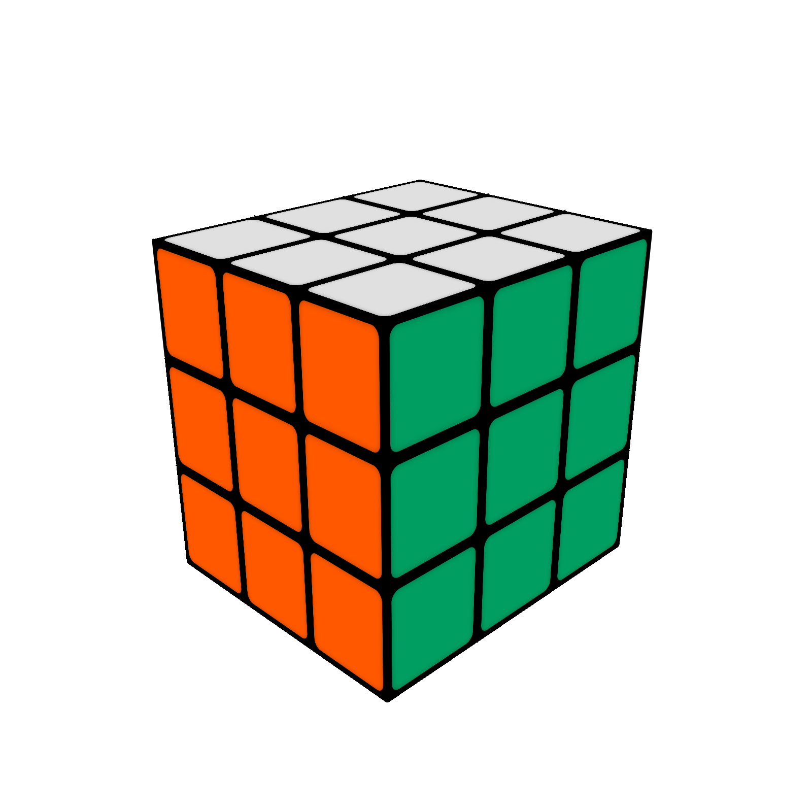

# Rubik's Cube Logic Engine & Simulator

<div align="center">
  
</div>

## Overview

This application is a 3D animated, Interactive Rubik's Cube simulator and mathematical solver built from scratch using Vue.js. It aims to provide seamless mechanical interactions and mathematically perfectly rigorous tracking of a classic 3x3 Rubik's Cube state. 

The software operates entirely in the browser using a custom Group Theory mathematical engine (`DeepCube.js`), which separates the heavy analytical permutation tracking from the 3D CSS visual layer using Web Workers.

## Features

- **Mechanical Realism:** 3D CSS rendering precisely models physical cube mechanics. Dragging edge and corner pieces rotates the specific mechanical layer dynamically, while dragging the center elements pivots the entire camera view.
- **Reactive Algorithm Queue:** Execute complex algorithms fluidly. The dynamic queue evaluates incoming inputs and instantly intercepts redundances (e.g. evaluating `U U` into a single `U2` animation, or cancelling out `F` into `F'` on the fly).
- **Deep Mathematical Engine:** Based entirely on Group Theory. It stores corner and edge permutation arrays combined with spatial orientation parities to guarantee that only physically legal mechanical states exist or can be scrambled.
- **Intelligent Solvers:** 
    - **Beginner Method (Human):** Constructs the solution layer-by-layer simulating human heuristics natively with instantaneous $O(1)$ algorithmic macros.
    - **Kociemba's Algorithm (Optimal):** Offloads pruning tables and recursive heuristic searches to Web Workers to instantly calculate and stream back the objectively shortest path solution (typically <20 moves).
- **High Performance:** Decoupling the single-threaded UI rendering stack from mathematical validations ensures 60 FPS 3D animations, even while executing computationally expensive analytical algorithms in the background.

## Development & Asset Generation

To keep the production build lightweight and avoid native dependency issues on servers (e.g. Docker), heavy packages like `canvas`, `puppeteer`, and `imagetracerjs` have been removed from the default `devDependencies`.

If you need to run the auxiliary scripts in `scripts/` (for screenshotting or regenerating `cube.svg`), you must install them manually:

```bash
npm install -D canvas puppeteer imagetracerjs
```

These are only required for offline asset optimization and are not needed to build or run the main application.
